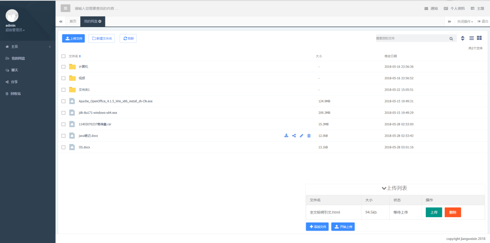

# 网盘系统
这是我的毕业设计所写的项目，设计并实现一个网盘系统，之前感觉代码写得比较乱，现在有时间想重新整理一下。

# 界面效果

# 项目结构
项目主要分为一下几个模块

### web-service
主要功能是页面展示，交互

### file-service
主要是面向客户端提供文件传输，上传或下载文件

### file-core
主要功能是对文件进行处理，包括文件转换，文件预览，文件转储等功能

### admin
简单的超级管理员功能

# 主要技术

- springboot
- netty
- redis
- hdfs
